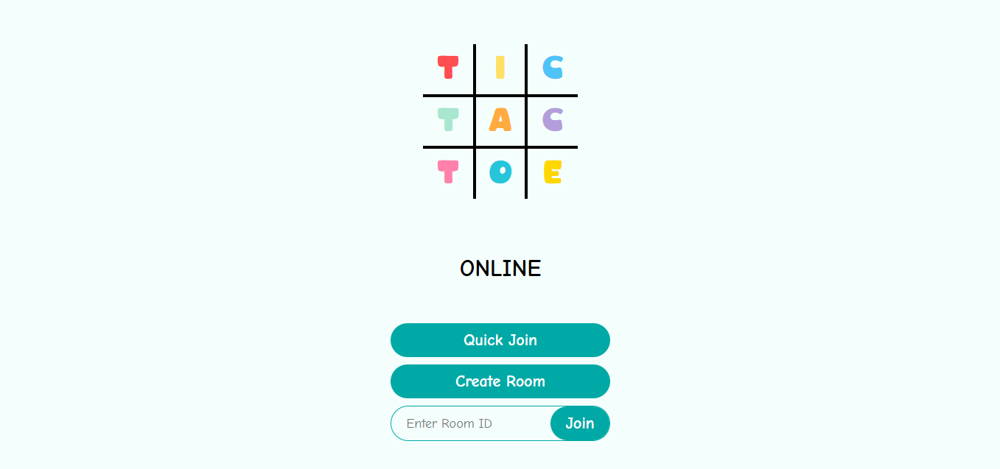
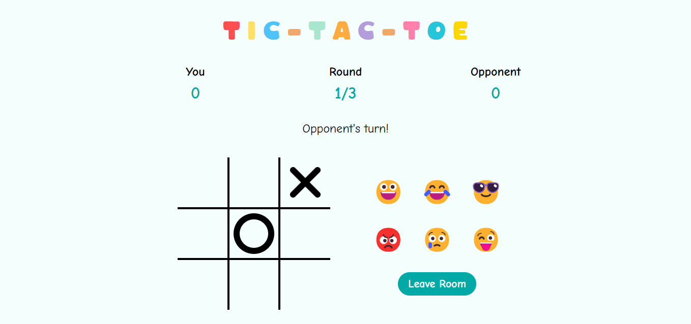

# Tic-Tac-Toe Online

A multiplayer online Tic Tac Toe game where players can play against each other in real-time.

Live demo, visit [Tic-Tac-Toe Online](https://tic-tac-toe-online-a8eq.onrender.com/)


## Table of Contents

- [Demo](#demo)
- [Features](#features)
- [Tech Stack](#tech-stack)
- [Installation](#installation)
## Demo



_Main Menu Screen_


_Gameplay Screen_
## Features

- Real-time gameplay
- Multiplayer support
- Simple and intuitive interface
- Emoji reactions


## Tech Stack

- **Frontend**: html, css, JavaScript 
- **Backend**: Express
- **Version Control**: Git

## Key Libraries

- socket.io - To enable real-time, bidirectional communication between web clients and servers.
- socket.io-client - The client-side library for Socket.IO
## Installation

1. Clone the repository

```bash
git clone https://github.com/aimless-coder/tic_tac_toe_online.git
cd tic_tac_toe_online
```

2. Install dependencies

```bash
npm install
```

3. Start the development server

```bash
node backend/index.js
```
    
## How to Play

1. Open the game in your browser
2. Create a new game or join an existing one
3. Share the game link with your opponent
4. Take turns placing X's and O's on the board
5. First player to get three in a row wins!
